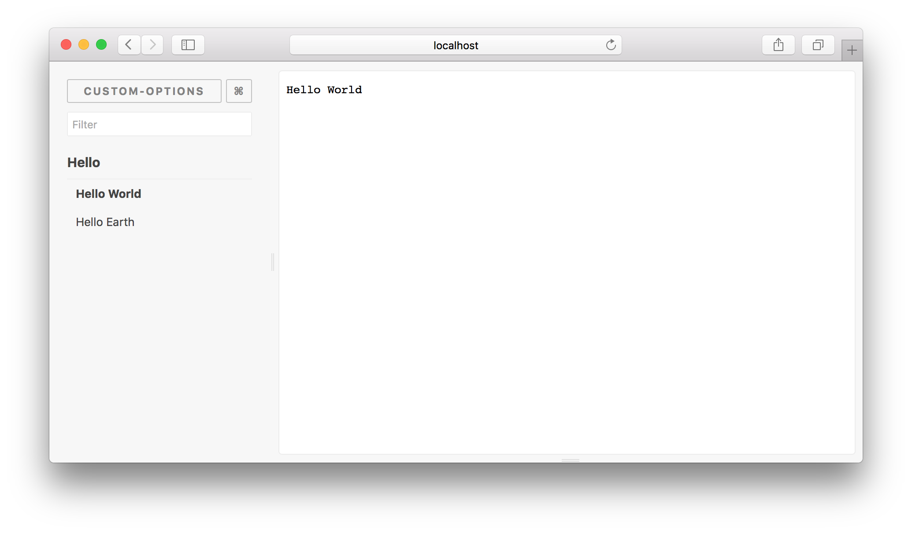

# Storybook Options Addon

[](https://circleci.com/gh/storybooks/storybook)
[](https://www.codefactor.io/repository/github/storybooks/storybook)
[](https://snyk.io/test/github/storybooks/storybook/8f36abfd6697e58cd76df3526b52e4b9dc894847)
[](https://bettercodehub.com/results/storybooks/storybook) [](https://codecov.io/gh/storybooks/storybook)  
[](https://now-examples-slackin-rrirkqohko.now.sh/)
[](#backers) [](#sponsors)

* * *

The Options addon can be used to (re-)configure the [Storybook](https://storybook.js.org) UI at runtime.

[Framework Support](https://github.com/storybooks/storybook/blob/master/ADDONS_SUPPORT.md)



## Getting Started

First, install the addon

```sh
npm install -D @storybook/addon-options
```

Add this line to your `addons.js` file (create this file inside your storybook config directory if needed).

```js
import '@storybook/addon-options/register';
```

Import and use the `setOptions` function in your config.js file.

```js
import * as storybook from '@storybook/react';
import { setOptions } from '@storybook/addon-options';

// Option defaults:
setOptions({
  /**
   * name to display in the top left corner
   * @type {String}
   */
  name: 'Storybook',
  /**
   * URL for name in top left corner to link to
   * @type {String}
   */
  url: '#',
  /**
   * show story component as full screen
   * @type {Boolean}
   */
  goFullScreen: false,
  /**
   * display panel that shows a list of stories
   * @type {Boolean}
   */
  showStoriesPanel: true,
  /**
   * display panel that shows addon configurations
   * @type {Boolean}
   */
  showAddonPanel: true,
  /**
   * display floating search box to search through stories
   * @type {Boolean}
   */
  showSearchBox: false,
  /**
   * show addon panel as a vertical panel on the right
   * @type {Boolean}
   */
  addonPanelInRight: false,
  /**
   * sorts stories
   * @type {Boolean}
   */
  sortStoriesByKind: false,
  /**
   * regex for finding the hierarchy separator
   * @example:
   *   null - turn off hierarchy
   *   /\// - split by `/`
   *   /\./ - split by `.`
   *   /\/|\./ - split by `/` or `.`
   * @type {Regex}
   */
  hierarchySeparator: null,
  /**
   * regex for finding the hierarchy root separator
   * @example:
   *   null - turn off mulitple hierarchy roots
   *   /\|/ - split by `|`
   * @type {Regex}
   */
  hierarchyRootSeparator: null,
  /**
   * sidebar tree animations
   * @type {Boolean}
   */
  sidebarAnimations: true,
  /**
   * id to select an addon panel
   * @type {String}
   */
  selectedAddonPanel: undefined, // The order of addons in the "Addon panel" is the same as you import them in 'addons.js'. The first panel will be opened by default as you run Storybook
  /**
   * enable/disable shortcuts
   * @type {Boolean}
   */
  enableShortcuts: false, // true by default
});

storybook.configure(() => require('./stories'), module);
```
It is also possible to call `setOptions()` inside individual stories. Note that this will bring impact story render performance significantly.
